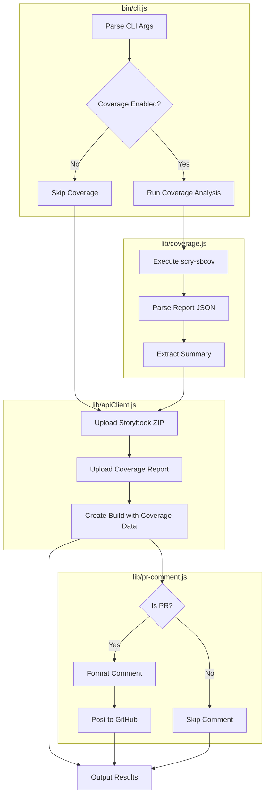

# Implementation Plan: scry-node Coverage Integration

## Overview

This plan implements the `02-scry-node-spec.md` specification to add coverage analysis capabilities to the scry-deployer CLI. The implementation emphasizes **high test coverage** and **solid documentation** as requested.

---

## Architecture Diagram



---

## File Changes Summary

| File | Action | Description |
|------|--------|-------------|
| `package.json` | Modify | Add dependencies and test scripts |
| `bin/cli.js` | Modify | Add coverage CLI options |
| `lib/coverage.js` | **Create** | Coverage analysis module |
| `lib/pr-comment.js` | **Create** | PR comment posting module |
| `lib/apiClient.js` | Modify | Handle coverage upload |
| `lib/config.js` | Modify | Add coverage configuration |
| `templates/workflows/deploy-storybook.yml` | Modify | Add coverage support |
| `templates/workflows/deploy-pr-preview.yml` | Modify | Add coverage support |
| `test/coverage.test.js` | **Create** | Unit tests for coverage module |
| `test/pr-comment.test.js` | **Create** | Unit tests for PR comment module |
| `test/apiClient.test.js` | **Create** | Unit tests for API client |
| `test/cli.test.js` | **Create** | Integration tests for CLI |
| `jest.config.js` | **Create** | Jest configuration |
| `docs/COVERAGE.md` | **Create** | Coverage feature documentation |

---

## Implementation Steps

### Phase 1: Testing Infrastructure Setup

#### 1.1 Install Testing Dependencies

Add to `package.json`:
```json
{
  "devDependencies": {
    "jest": "^29.7.0",
    "@types/jest": "^29.5.0",
    "jest-mock-extended": "^3.0.0"
  },
  "scripts": {
    "test": "jest",
    "test:watch": "jest --watch",
    "test:coverage": "jest --coverage"
  }
}
```

#### 1.2 Create Jest Configuration

Create `jest.config.js`:
```javascript
module.exports = {
  testEnvironment: 'node',
  coverageDirectory: 'coverage',
  collectCoverageFrom: [
    'lib/**/*.js',
    'bin/**/*.js',
    '!**/node_modules/**'
  ],
  coverageThreshold: {
    global: {
      branches: 80,
      functions: 80,
      lines: 80,
      statements: 80
    }
  },
  testMatch: ['**/test/**/*.test.js'],
  verbose: true
};
```

---

### Phase 2: New Module Creation

#### 2.1 Create `lib/coverage.js`

**Purpose:** Run coverage analysis using `@scrymore/scry-sbcov` and extract summary data.

**Key Functions:**
- `runCoverageAnalysis(options)` - Execute scry-sbcov CLI
- `extractCoverageSummary(report)` - Extract summary from full report
- `loadCoverageReport(filePath)` - Load existing coverage report

**Test Coverage Requirements:**
- Test successful coverage analysis execution
- Test handling of missing storybook directory
- Test extraction of coverage summary
- Test error handling when scry-sbcov fails
- Test `--ci` flag behavior with threshold failures

#### 2.2 Create `lib/pr-comment.js`

**Purpose:** Post coverage summary as PR comments on GitHub.

**Key Functions:**
- `postPRComment(deployResult, coverageReport)` - Post or update PR comment
- `formatPRComment(deployResult, coverageReport)` - Format markdown comment
- `findExistingComment(octokit, owner, repo, prNumber)` - Find existing bot comment

**Test Coverage Requirements:**
- Test comment formatting with coverage data
- Test comment formatting without coverage data
- Test finding existing comments
- Test creating new comments
- Test updating existing comments
- Test handling missing GITHUB_TOKEN
- Test handling non-PR context

---

### Phase 3: Existing Module Updates

#### 3.1 Update `bin/cli.js`

**New CLI Options:**
```
--coverage-report <path>     Path to existing coverage report JSON
--no-coverage                Skip coverage analysis
--coverage-fail-on-threshold Fail if coverage thresholds not met
--coverage-base <branch>     Base branch for new code analysis (default: main)
```

**Changes:**
- Add new options to yargs configuration
- Integrate coverage analysis into deployment flow
- Call PR comment posting after successful deployment

#### 3.2 Update `lib/apiClient.js`

**New Functions:**
- `uploadCoverageReport(coverageReport, versionId)` - Upload coverage JSON to R2
- `createBuildWithCoverage(buildData)` - Create build with coverage summary

**Changes to `uploadFileDirectly`:**
- Accept optional `coverageReport` parameter
- Upload coverage report alongside storybook ZIP
- Include coverage summary in build creation API call

#### 3.3 Update `lib/config.js`

**New Configuration Options:**
```javascript
{
  coverage: true,              // Enable coverage analysis
  coverageReport: null,        // Path to existing report
  coverageFailOnThreshold: false,
  coverageBase: 'main'
}
```

**Environment Variable Mapping:**
- `SCRY_COVERAGE_ENABLED` → `coverage`
- `SCRY_COVERAGE_REPORT` → `coverageReport`
- `SCRY_COVERAGE_FAIL_ON_THRESHOLD` → `coverageFailOnThreshold`
- `SCRY_COVERAGE_BASE` → `coverageBase`

---

### Phase 4: Workflow Template Updates

#### 4.1 Update `deploy-storybook.yml`

**Key Changes:**
- Add `fetch-depth: 0` for git history access
- Add coverage-related environment variables
- Add conditional coverage flags

#### 4.2 Update `deploy-pr-preview.yml`

**Key Changes:**
- Add `fetch-depth: 0` for git history access
- Add coverage to PR comment output
- Add draft PR skip option

---

### Phase 5: Documentation

#### 5.1 Create `docs/COVERAGE.md`

**Contents:**
- Feature overview
- Configuration options
- CLI usage examples
- GitHub Actions setup
- Troubleshooting guide
- API reference

#### 5.2 Update `README.md`

**Add Sections:**
- Coverage analysis feature description
- Quick start for coverage
- Link to detailed documentation

---

## Test Plan

### Unit Tests

| Module | Test File | Coverage Target |
|--------|-----------|-----------------|
| `lib/coverage.js` | `test/coverage.test.js` | 90% |
| `lib/pr-comment.js` | `test/pr-comment.test.js` | 90% |
| `lib/apiClient.js` | `test/apiClient.test.js` | 85% |
| `lib/config.js` | `test/config.test.js` | 85% |

### Integration Tests

| Test | Description |
|------|-------------|
| Full deployment with coverage | End-to-end test of deployment with coverage enabled |
| Deployment without coverage | Verify `--no-coverage` flag works |
| PR comment posting | Test GitHub API integration |
| Threshold failure | Test `--coverage-fail-on-threshold` behavior |

### Test Fixtures

Create `test/fixtures/`:
- `sample-coverage-report.json` - Sample coverage report
- `storybook-static/` - Minimal storybook build for testing

---

## Dependencies

### Production Dependencies

```json
{
  "@octokit/rest": "^20.0.0",
  "@scrymore/scry-sbcov": "^0.1.0"
}
```

### Dev Dependencies

```json
{
  "jest": "^29.7.0",
  "@types/jest": "^29.5.0",
  "jest-mock-extended": "^3.0.0"
}
```

---

## Risk Assessment

| Risk | Mitigation |
|------|------------|
| `scry-sbcov` not installed | Direct dependency, bundled with scry-deployer |
| Git history not available | Clear error message, document `fetch-depth: 0` requirement |
| GitHub API rate limits | Use existing GITHUB_TOKEN, implement retry logic |
| Large coverage reports | Compress before upload, set size limits |

---

## Implementation Order

1. **Testing Infrastructure** - Set up Jest, create test fixtures
2. **lib/coverage.js** - Core coverage analysis with tests
3. **lib/pr-comment.js** - PR comment posting with tests
4. **lib/config.js updates** - Add coverage config options with tests
5. **lib/apiClient.js updates** - Add coverage upload with tests
6. **bin/cli.js updates** - Integrate all components with tests
7. **Workflow templates** - Update GitHub Actions templates
8. **Documentation** - Create comprehensive docs
9. **Integration tests** - End-to-end testing
10. **Final review** - Code review, coverage verification

---

## Success Criteria

- [ ] All unit tests pass with >80% coverage
- [ ] Integration tests pass
- [ ] Documentation is complete and accurate
- [ ] CLI help text is clear and helpful
- [ ] Workflow templates work in GitHub Actions
- [ ] PR comments display correctly
- [ ] Coverage reports upload successfully
- [ ] Error messages are helpful and actionable
