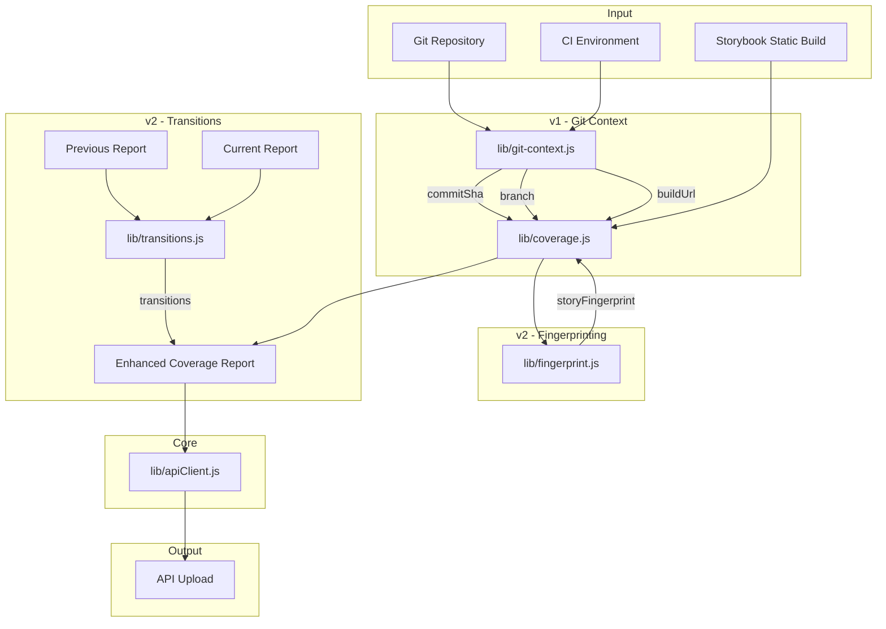

# GitHub Ticketing Feature - Implementation Plan

## Overview

This plan implements the GitHub ticketing feature for `scry-node` as specified in [`plans/github-ticketing-feature.md`](github-ticketing-feature.md). The feature enables:

1. **v1**: Git/build context in coverage reports (commitSha, branch, buildUrl)
2. **v2**: Story fingerprinting for cross-build correlation
3. **v2**: Story lifecycle transitions (failing→passing, etc.)

---

## Architecture Diagram



---

## v1 Implementation: Git Context

### Goal
Ensure coverage reports include git/build context for meaningful GitHub issue links.

### New Module: `lib/git-context.js`

```javascript
// Exports:
// - getGitContext() -> { commitSha, branch, buildUrl, buildId, prNumber }
// - extractCIContext() -> CI-specific context from environment
```

#### Data Sources (Priority Order)

| Field | GitHub Actions | GitLab CI | Bitbucket | Local Git |
|-------|---------------|-----------|-----------|-----------|
| `commitSha` | `GITHUB_SHA` | `CI_COMMIT_SHA` | `BITBUCKET_COMMIT` | `git rev-parse HEAD` |
| `branch` | `GITHUB_REF_NAME` or parse `GITHUB_REF` | `CI_COMMIT_REF_NAME` | `BITBUCKET_BRANCH` | `git branch --show-current` |
| `buildUrl` | Construct from `GITHUB_SERVER_URL`, `GITHUB_REPOSITORY`, `GITHUB_RUN_ID` | `CI_PIPELINE_URL` | `BITBUCKET_BUILD_URL` | `null` |
| `buildId` | `GITHUB_RUN_ID` | `CI_PIPELINE_ID` | `BITBUCKET_BUILD_NUMBER` | `null` |
| `prNumber` | Parse from `GITHUB_REF` or `GITHUB_EVENT_PATH` | `CI_MERGE_REQUEST_IID` | `BITBUCKET_PR_ID` | `null` |

### Integration Points

1. **[`lib/coverage.js`](../lib/coverage.js)**: Modify `runCoverageAnalysis` to call `getGitContext()` and merge into report
2. **[`lib/apiClient.js`](../lib/apiClient.js)**: `uploadCoverageReportDirectly` already accepts full report - no changes needed

### Files to Modify

| File | Changes |
|------|---------|
| `lib/git-context.js` | **NEW** - Git/CI context extraction |
| `lib/coverage.js` | Import and call `getGitContext()`, merge into report output |
| `test/git-context.test.js` | **NEW** - Comprehensive tests |
| `test/coverage.test.js` | Add tests for git context integration |

### Test Cases for `lib/git-context.js`

```javascript
// GitHub Actions context
- getGitContext() returns commitSha from GITHUB_SHA
- getGitContext() returns branch from GITHUB_REF_NAME
- getGitContext() parses PR number from refs/pull/123/merge
- getGitContext() constructs buildUrl from GitHub env vars
- getGitContext() reads PR base SHA from GITHUB_EVENT_PATH

// GitLab CI context
- getGitContext() returns commitSha from CI_COMMIT_SHA
- getGitContext() returns branch from CI_COMMIT_REF_NAME
- getGitContext() returns buildUrl from CI_PIPELINE_URL
- getGitContext() returns prNumber from CI_MERGE_REQUEST_IID

// Bitbucket context
- getGitContext() returns commitSha from BITBUCKET_COMMIT
- getGitContext() returns branch from BITBUCKET_BRANCH
- getGitContext() returns prNumber from BITBUCKET_PR_ID

// Local git fallback
- getGitContext() falls back to git commands when no CI env
- getGitContext() handles git command failures gracefully
- getGitContext() returns partial context when some fields unavailable

// Edge cases
- getGitContext() returns empty object when no git and no CI
- getGitContext() sanitizes branch names for URL safety
- getGitContext() handles detached HEAD state
```

---

## v2 Implementation: Story Fingerprinting

### Goal
Generate stable fingerprints for stories to enable cross-build correlation.

### New Module: `lib/fingerprint.js`

```javascript
// Exports:
// - generateStoryFingerprint(story) -> string
// - addFingerprintsToReport(report) -> enhancedReport
```

#### Fingerprint Algorithm

```javascript
// Inputs for fingerprint (must be stable across builds):
// 1. Component file path (relative to project root)
// 2. Story ID (from Storybook)
// 3. Story name/title

// Algorithm:
function generateStoryFingerprint(story) {
  const input = [
    story.componentPath || '',
    story.storyId || story.id || '',
    story.storyName || story.name || ''
  ].join('::');
  
  return createHash('sha256')
    .update(input)
    .digest('hex')
    .substring(0, 16); // 16-char hex = 64 bits, sufficient for uniqueness
}
```

### Integration Points

1. **[`lib/coverage.js`](../lib/coverage.js)**: After loading report, call `addFingerprintsToReport()`
2. Report structure enhancement:

```javascript
// Before (current structure)
{
  stories: [
    { id: 'button--primary', name: 'Primary', ... }
  ]
}

// After (with fingerprints)
{
  stories: [
    { 
      id: 'button--primary', 
      name: 'Primary',
      fingerprint: 'a1b2c3d4e5f6g7h8',  // NEW
      ...
    }
  ]
}
```

### Files to Modify

| File | Changes |
|------|---------|
| `lib/fingerprint.js` | **NEW** - Fingerprint generation |
| `lib/coverage.js` | Import and call `addFingerprintsToReport()` |
| `test/fingerprint.test.js` | **NEW** - Comprehensive tests |
| `test/coverage.test.js` | Add tests for fingerprint integration |

### Test Cases for `lib/fingerprint.js`

```javascript
// Basic fingerprinting
- generateStoryFingerprint() returns consistent hash for same inputs
- generateStoryFingerprint() returns different hash for different inputs
- generateStoryFingerprint() handles missing componentPath
- generateStoryFingerprint() handles missing storyId
- generateStoryFingerprint() handles missing storyName

// Stability tests
- generateStoryFingerprint() is stable across story ordering changes
- generateStoryFingerprint() is stable when other story fields change
- generateStoryFingerprint() produces same result for equivalent stories

// Report enhancement
- addFingerprintsToReport() adds fingerprint to each story
- addFingerprintsToReport() preserves existing story fields
- addFingerprintsToReport() handles empty stories array
- addFingerprintsToReport() handles null/undefined report
- addFingerprintsToReport() handles stories without required fields
```

---

## v2 Implementation: Story Lifecycle Transitions

### Goal
Compute story state transitions between builds for GitHub issue lifecycle automation.

### New Module: `lib/transitions.js`

```javascript
// Exports:
// - computeTransitions(previousReport, currentReport) -> TransitionResult
// - TransitionType enum: FIXED, BROKEN, STILL_FAILING, STILL_PASSING, NEW_FAILURE, NEW_PASSING
```

#### Transition Types

| Previous State | Current State | Transition | GitHub Action |
|---------------|---------------|------------|---------------|
| failing | passing | `FIXED` | Auto-close issue |
| failing | failing | `STILL_FAILING` | No-op (maybe comment) |
| passing | failing | `BROKEN` | Auto-open/comment |
| passing | passing | `STILL_PASSING` | No-op |
| (new) | failing | `NEW_FAILURE` | Auto-open issue |
| (new) | passing | `NEW_PASSING` | No-op |
| failing | (removed) | `REMOVED_WHILE_FAILING` | Comment on issue |
| passing | (removed) | `REMOVED_WHILE_PASSING` | No-op |

#### Output Structure

```javascript
{
  transitions: {
    fixed: ['fingerprint1', 'fingerprint2'],      // failing → passing
    broken: ['fingerprint3'],                      // passing → failing
    stillFailing: ['fingerprint4'],                // failing → failing
    newFailures: ['fingerprint5'],                 // new → failing
    removedWhileFailing: ['fingerprint6']          // failing → removed
  },
  summary: {
    totalFixed: 2,
    totalBroken: 1,
    totalStillFailing: 1,
    totalNewFailures: 1
  },
  // Detailed info for each transition
  details: {
    'fingerprint1': {
      storyId: 'button--primary',
      storyName: 'Primary',
      componentPath: 'src/Button.tsx',
      transition: 'FIXED',
      previousStatus: 'failing',
      currentStatus: 'passing'
    }
  }
}
```

### Integration Points

1. **[`lib/coverage.js`](../lib/coverage.js)**: Add optional `previousReport` parameter
2. **[`lib/apiClient.js`](../lib/apiClient.js)**: Include transitions in upload payload
3. **[`bin/cli.js`](../bin/cli.js)**: Add `--previous-report` CLI option

### Files to Modify

| File | Changes |
|------|---------|
| `lib/transitions.js` | **NEW** - Transition computation |
| `lib/coverage.js` | Add `computeTransitions()` call when previous report available |
| `lib/apiClient.js` | Include transitions in coverage upload |
| `bin/cli.js` | Add `--previous-report` option |
| `test/transitions.test.js` | **NEW** - Comprehensive tests |
| `test/coverage.test.js` | Add tests for transitions integration |

### Test Cases for `lib/transitions.js`

```javascript
// Basic transitions
- computeTransitions() identifies FIXED stories (failing → passing)
- computeTransitions() identifies BROKEN stories (passing → failing)
- computeTransitions() identifies STILL_FAILING stories
- computeTransitions() identifies NEW_FAILURE stories
- computeTransitions() identifies REMOVED_WHILE_FAILING stories

// Edge cases
- computeTransitions() handles null previousReport (all current failures are NEW)
- computeTransitions() handles null currentReport
- computeTransitions() handles empty stories arrays
- computeTransitions() handles stories without fingerprints
- computeTransitions() matches by fingerprint, not by storyId

// Summary computation
- computeTransitions() returns correct summary counts
- computeTransitions() returns empty transitions when no changes

// Detail generation
- computeTransitions() includes story details for each transition
- computeTransitions() preserves component path in details
```

---

## Test Coverage Requirements

### New Modules (100% Target)

| Module | Branches | Functions | Lines | Statements |
|--------|----------|-----------|-------|------------|
| `lib/git-context.js` | 100% | 100% | 100% | 100% |
| `lib/fingerprint.js` | 100% | 100% | 100% | 100% |
| `lib/transitions.js` | 100% | 100% | 100% | 100% |

### Updated `jest.config.js`

```javascript
collectCoverageFrom: [
  'bin/cli.js',
  'lib/apiClient.js',
  'lib/config.js',
  'lib/coverage.js',
  'lib/pr-comment.js',
  'lib/templates.js',
  'lib/git-context.js',    // NEW
  'lib/fingerprint.js',    // NEW
  'lib/transitions.js',    // NEW
],

coverageThreshold: {
  // ... existing thresholds ...
  
  './lib/git-context.js': {
    branches: 90,
    functions: 100,
    lines: 95,
    statements: 95,
  },
  './lib/fingerprint.js': {
    branches: 100,
    functions: 100,
    lines: 100,
    statements: 100,
  },
  './lib/transitions.js': {
    branches: 90,
    functions: 100,
    lines: 95,
    statements: 95,
  },
}
```

---

## Implementation Order

### Phase 1: v1 Git Context
1. Create `lib/git-context.js` with full test coverage
2. Create `test/git-context.test.js`
3. Integrate into `lib/coverage.js`
4. Update `test/coverage.test.js`
5. Update `jest.config.js`

### Phase 2: v2 Fingerprinting
1. Create `lib/fingerprint.js` with full test coverage
2. Create `test/fingerprint.test.js`
3. Integrate into `lib/coverage.js`
4. Update `test/coverage.test.js`

### Phase 3: v2 Transitions
1. Create `lib/transitions.js` with full test coverage
2. Create `test/transitions.test.js`
3. Integrate into `lib/coverage.js`
4. Add CLI option to `bin/cli.js`
5. Update `lib/apiClient.js` if needed
6. Update tests

### Phase 4: Documentation & Cleanup
1. Update `CLAUDE.md` with new modules
2. Update `README.md` with new CLI options
3. Update `plans/github-ticketing-feature.md` with implementation status

---

## API Contract

### Enhanced Coverage Report Structure

```javascript
{
  // Existing fields
  summary: { ... },
  qualityGate: { ... },
  generatedAt: '2026-01-26T00:00:00.000Z',
  stories: [ ... ],
  
  // v1: Git context (NEW)
  gitContext: {
    commitSha: 'abc123def456...',
    branch: 'feature/my-branch',
    buildUrl: 'https://github.com/org/repo/actions/runs/12345',
    buildId: '12345',
    prNumber: 42,
    commitUrl: 'https://github.com/org/repo/commit/abc123'
  },
  
  // v2: Stories with fingerprints (ENHANCED)
  stories: [
    {
      id: 'button--primary',
      name: 'Primary',
      fingerprint: 'a1b2c3d4e5f6g7h8',  // NEW
      status: 'passing',
      // ... other fields
    }
  ],
  
  // v2: Transitions (NEW, optional)
  transitions: {
    fixed: ['fingerprint1'],
    broken: ['fingerprint2'],
    stillFailing: [],
    newFailures: ['fingerprint3'],
    summary: {
      totalFixed: 1,
      totalBroken: 1,
      totalNewFailures: 1
    }
  }
}
```

---

## Risk Mitigation

| Risk | Mitigation |
|------|------------|
| Git commands fail in CI | Graceful fallback to CI env vars only |
| Fingerprint collisions | Use 64-bit hash (16 hex chars) - collision probability negligible |
| Previous report unavailable | Transitions are optional; report valid without them |
| Breaking existing report consumers | All new fields are additive; existing fields unchanged |
| Performance impact | Fingerprinting is O(n) where n = story count; negligible |

---

## Success Criteria

1. ✅ Coverage reports include `commitSha` and `branch` when available
2. ✅ Each story has a stable `fingerprint` field
3. ✅ Given two reports, transitions can be computed
4. ✅ All new code has 100% test coverage
5. ✅ Existing tests continue to pass
6. ✅ No breaking changes to existing API contracts
