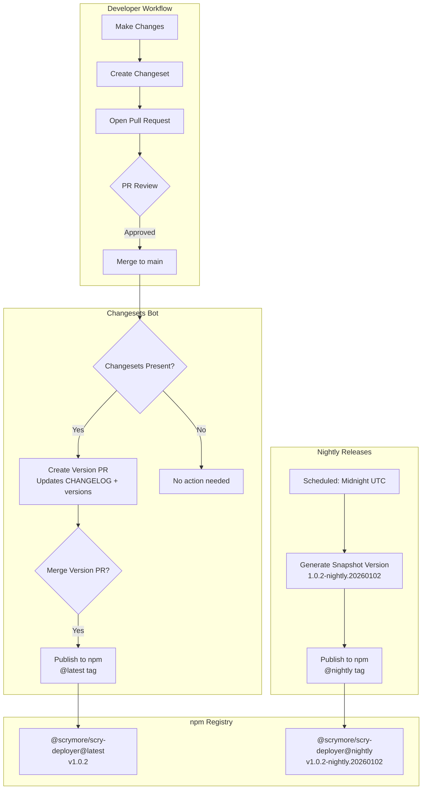
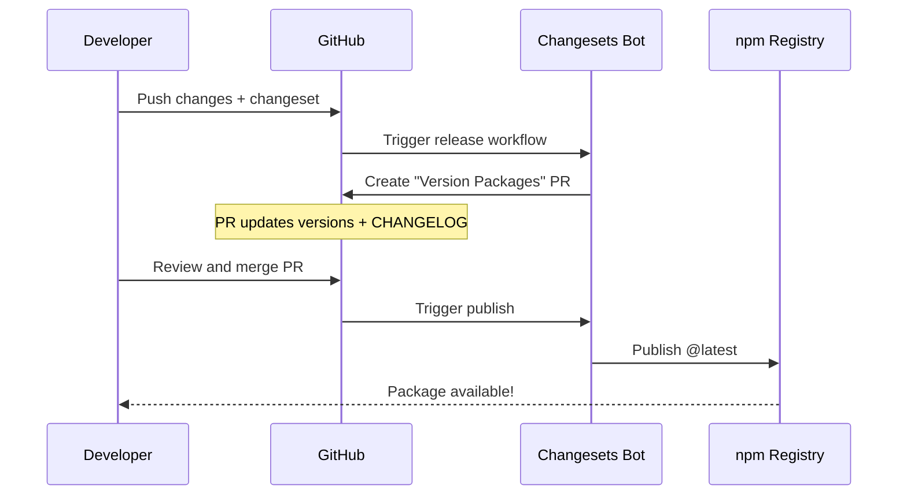

# npm Release Strategy with Changesets

## Overview

This plan outlines the implementation of a robust release workflow for `@scrymore/scry-deployer` using [Changesets](https://github.com/changesets/changesets) for version management, with support for both **stable releases** and **nightly/snapshot releases**.

**Configuration:**
- **GitHub Repository**: `github.com/epinnock/scry-node`
- **npm Organization**: `scrymore`
- **Package Name**: `@scrymore/scry-deployer`

## Architecture



## Implementation Steps

### 1. Initialize Changesets

Run the following command to set up Changesets:

```bash
pnpm add -D @changesets/cli @changesets/changelog-github
npx @changesets/cli init
```

This creates:
- `.changeset/config.json` - Configuration file
- `.changeset/README.md` - Documentation for contributors

### 2. Configure Changesets

Update `.changeset/config.json`:

```json
{
  "$schema": "https://unpkg.com/@changesets/config@latest/schema.json",
  "changelog": ["@changesets/changelog-github", { "repo": "epinnock/scry-node" }],
  "commit": false,
  "fixed": [],
  "linked": [],
  "access": "public",
  "baseBranch": "main",
  "updateInternalDependencies": "patch",
  "ignore": [],
  "snapshot": {
    "useCalculatedVersion": true,
    "prereleaseTemplate": "{tag}.{datetime}"
  }
}
```

Key settings:
- `access: "public"` - Required for scoped packages (`@scrymore/*`)
- `changelog: @changesets/changelog-github` - Generates GitHub-linked changelogs
- `snapshot` - Configures nightly release versioning

### 3. Update package.json

Add the following to `package.json`:

```json
{
  "scripts": {
    "changeset": "changeset",
    "version": "changeset version",
    "release": "changeset publish"
  },
  "publishConfig": {
    "access": "public",
    "registry": "https://registry.npmjs.org/"
  },
  "repository": {
    "type": "git",
    "url": "https://github.com/epinnock/scry-node.git"
  }
}
```

### 4. Create Stable Release Workflow

Create `.github/workflows/release.yml`:

```yaml
name: Release

on:
  push:
    branches:
      - main

concurrency: ${{ github.workflow }}-${{ github.ref }}

jobs:
  release:
    name: Release
    runs-on: ubuntu-latest
    permissions:
      contents: write
      pull-requests: write
      id-token: write
    
    steps:
      - name: Checkout
        uses: actions/checkout@v4
        with:
          fetch-depth: 0

      - name: Setup pnpm
        uses: pnpm/action-setup@v2
        with:
          version: 8

      - name: Setup Node.js
        uses: actions/setup-node@v4
        with:
          node-version: '20'
          cache: 'pnpm'
          registry-url: 'https://registry.npmjs.org'

      - name: Install dependencies
        run: pnpm install --frozen-lockfile

      - name: Create Release Pull Request or Publish
        id: changesets
        uses: changesets/action@v1
        with:
          version: pnpm run version
          publish: pnpm run release
          commit: "chore: version packages"
          title: "chore: release packages"
        env:
          GITHUB_TOKEN: ${{ secrets.GITHUB_TOKEN }}
          NPM_TOKEN: ${{ secrets.NPM_TOKEN }}
          NODE_AUTH_TOKEN: ${{ secrets.NPM_TOKEN }}
```

### 5. Create Nightly Release Workflow

Create `.github/workflows/nightly.yml`:

```yaml
name: Nightly Release

on:
  schedule:
    # Run every day at midnight UTC
    - cron: '0 0 * * *'
  workflow_dispatch:
    inputs:
      tag:
        description: 'Snapshot tag (default: nightly)'
        required: false
        default: 'nightly'

jobs:
  nightly:
    name: Publish Nightly
    runs-on: ubuntu-latest
    
    steps:
      - name: Checkout
        uses: actions/checkout@v4
        with:
          fetch-depth: 0

      - name: Setup pnpm
        uses: pnpm/action-setup@v2
        with:
          version: 8

      - name: Setup Node.js
        uses: actions/setup-node@v4
        with:
          node-version: '20'
          cache: 'pnpm'
          registry-url: 'https://registry.npmjs.org'

      - name: Install dependencies
        run: pnpm install --frozen-lockfile

      - name: Check for changes since last release
        id: changes
        run: |
          LAST_TAG=$(git describe --tags --abbrev=0 2>/dev/null || echo "")
          if [ -z "$LAST_TAG" ]; then
            echo "has_changes=true" >> $GITHUB_OUTPUT
          else
            CHANGES=$(git diff --name-only $LAST_TAG HEAD -- lib/ bin/ package.json)
            if [ -n "$CHANGES" ]; then
              echo "has_changes=true" >> $GITHUB_OUTPUT
            else
              echo "has_changes=false" >> $GITHUB_OUTPUT
            fi
          fi

      - name: Create snapshot version
        if: steps.changes.outputs.has_changes == 'true'
        run: |
          TAG="${{ github.event.inputs.tag || 'nightly' }}"
          npx @changesets/cli version --snapshot $TAG

      - name: Publish snapshot
        if: steps.changes.outputs.has_changes == 'true'
        run: |
          TAG="${{ github.event.inputs.tag || 'nightly' }}"
          npx @changesets/cli publish --tag $TAG --no-git-tag
        env:
          NPM_TOKEN: ${{ secrets.NPM_TOKEN }}
          NODE_AUTH_TOKEN: ${{ secrets.NPM_TOKEN }}

      - name: Skip - No changes
        if: steps.changes.outputs.has_changes == 'false'
        run: echo "No changes since last release, skipping nightly build"
```

### 6. Create Initial CHANGELOG.md

Create `CHANGELOG.md`:

```markdown
# Changelog

All notable changes to this project will be documented in this file.

The format is based on [Keep a Changelog](https://keepachangelog.com/en/1.0.0/),
and this project adheres to [Semantic Versioning](https://semver.org/spec/v2.0.0.html).

## [Unreleased]

<!-- Changesets will automatically update this file -->
```

## Required GitHub Secrets

Configure these in your repository settings (`Settings > Secrets and variables > Actions`):

| Secret | Description | How to Get |
|--------|-------------|------------|
| `NPM_TOKEN` | npm automation token | npmjs.com > Access Tokens > Generate New Token > Automation |

> Note: `GITHUB_TOKEN` is automatically provided by GitHub Actions.

## Developer Workflow

### Creating a Changeset

When making changes that should be released:

```bash
# After making your changes
pnpm changeset

# Follow the prompts:
# 1. Select the package(s) affected
# 2. Choose bump type (major/minor/patch)
# 3. Write a summary of changes
```

This creates a file in `.changeset/` like:

```markdown
---
"@scrymore/scry-deployer": minor
---

Added new feature for automatic screenshot comparison
```

### Release Flow



## Installation Commands for Users

After implementation, users can install:

```bash
# Stable release (recommended)
npm install @scrymore/scry-deployer

# or with specific version
npm install @scrymore/scry-deployer@1.0.2

# Nightly release (bleeding edge)
npm install @scrymore/scry-deployer@nightly

# Specific nightly version
npm install @scrymore/scry-deployer@1.0.2-nightly.20260102
```

## Files to Create/Modify

| File | Action | Description |
|------|--------|-------------|
| `.changeset/config.json` | Create | Changesets configuration |
| `.changeset/README.md` | Create | Auto-generated by init |
| `.github/workflows/release.yml` | Create | Stable release workflow |
| `.github/workflows/nightly.yml` | Create | Nightly release workflow |
| `package.json` | Modify | Add scripts and publishConfig |
| `CHANGELOG.md` | Create | Changelog file |
| `CONTRIBUTING.md` | Create | Document release process |

## Pre-Release Checklist

Before implementing:

- [ ] Ensure `@scrymore` npm scope is claimed/accessible
- [ ] Generate npm automation token
- [ ] Add `NPM_TOKEN` to GitHub repository secrets
- [ ] Verify repository URL in package.json
- [ ] Consider adding tests before first publish

## Version Numbering

| Release Type | Version Format | npm Tag | Example |
|--------------|----------------|---------|---------|
| Stable | `X.Y.Z` | `latest` | `1.0.2` |
| Nightly | `X.Y.Z-nightly.YYYYMMDD` | `nightly` | `1.0.2-nightly.20260102` |
| Canary | `X.Y.Z-canary.YYYYMMDD` | `canary` | `1.0.2-canary.20260102` |

## Next Steps

1. Review this plan and confirm the approach
2. Switch to Code mode to implement the changes
3. Test the workflow with a dry-run release
4. Create first changeset and verify the process
